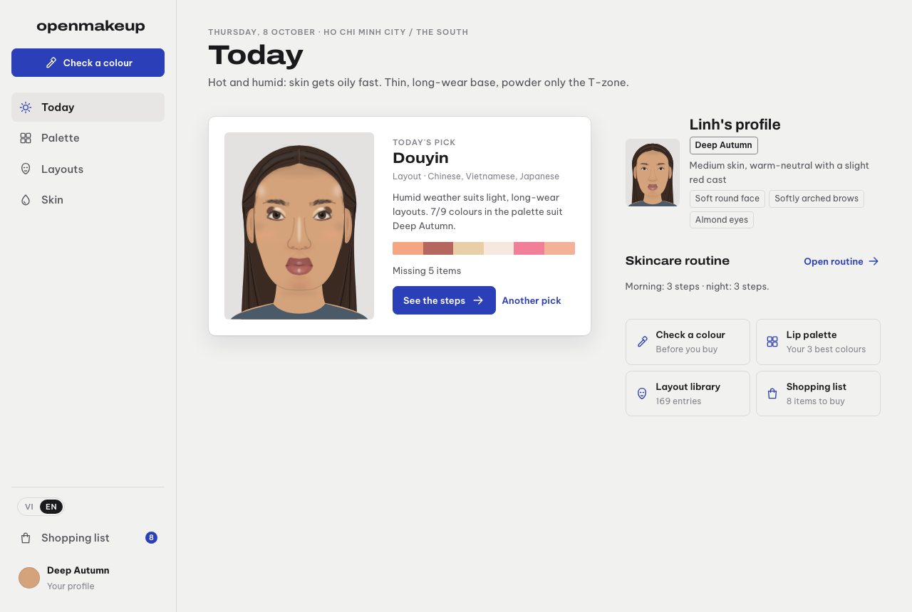
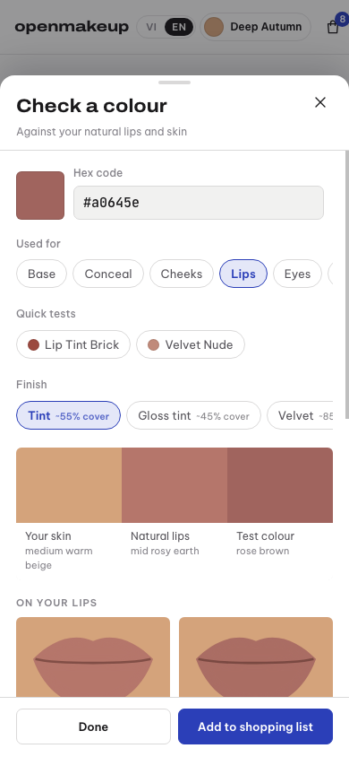

# openmakeup

[English](README.md) | **Tiếng Việt**

openmakeup là app web một tệp HTML giúp chọn màu trang điểm hợp với da, môi, mày và khuôn mặt của riêng mình. Giao diện mặc định là tiếng Việt, có thể chuyển sang English.

App trả lời bốn câu hỏi. Màu nào hợp với mình? Cây son hay chì mày này có hợp không? Hôm nay nên thử layout nào? Còn thiếu món nào cần mua?



## Features

- Kiểm tra màu. Chọn một màu bất kỳ, app kết luận bằng lời: hợp, tạm được hoặc không hợp, kèm lý do. Phần tính toán (Lab, LCh, CIEDE2000) chạy ngầm và không bao giờ hiện thành con số.
- Kiểm tra son. So màu với môi thật và với da, theo độ phủ của kiểu finish đã chọn (tint, gloss tint, velvet, matte, liner). Mục tiêu là đậm hơn môi thật một đến hai bậc. Có ghi chú khi viền môi cần kẻ chì trước.
- Kiểm tra mày và kẻ mắt. So màu với chân mày và tóc. Các tông xám lạnh nổi bật trên da ấm sẽ bị cảnh báo, trừ khi layout thuộc tông lạnh.
- Bảng màu theo mùa. Bảng Thu đậm (Deep Autumn) gồm màu nền, che khuyết điểm, má hồng, môi, mắt, tạo khối, highlight và chân mày. Mỗi bảng kèm các màu nên tránh và lý do. Màu nền và màu che khuyết điểm đi theo da.
- Thư viện layout. Thư viện gồm 169 layout, kỹ thuật, finish, dịp và phong cách trang điểm. Nguồn gốc trải từ Hàn Quốc, Trung Quốc, Nhật Bản, Việt Nam, Thái Lan đến phương Tây. Mỗi mục có bảng màu, các kỹ thuật chính và những trang đã dùng để đối chiếu.
- Danh sách mua tính theo phần còn thiếu. Chọn các layout muốn đánh, app tính ra cần mua gì, xếp theo số layout mà mỗi món hoàn thành được. App cũng chỉ ra màu gần nhất đang có và lý do màu đó chưa đủ.
- Hình khuôn mặt. Mỗi layout được vẽ trên một khuôn mặt trung tính, chỉnh lại theo tham số trong hồ sơ. Hình vẽ thay đổi theo quy tắc khuôn mặt trong hồ sơ, ví dụ đuôi kẻ ngắn.
- Theo dõi routine chăm da và gợi ý theo mùa tùy vị trí.
- Chạy offline sau khi đã mở. Mọi dữ liệu nhập vào đều nằm trong trình duyệt.



## Run it

Mở `app/index.html` bằng trình duyệt. Đó là một tệp duy nhất, không cần server và không có bước build. Request mạng duy nhất là tải web font, và app vẫn chạy khi không có font.

Để chạy qua server cục bộ:

```sh
python3 -m http.server 8000   # then open http://localhost:8000/app/
```

## Use your own profile

Bản demo hiển thị một người hư cấu. Có ba cách thay bằng hồ sơ của riêng mình:

1. Trong app, vào Hồ sơ, rồi Cài đặt, chọn Nhập hồ sơ (JSON). Hồ sơ được lưu trong trình duyệt (localStorage). Xuất sẽ lưu lại thành tệp, còn Quay về hồ sơ có sẵn sẽ hoàn tác.
2. Sửa trực tiếp tên, màu và vị trí trên màn hình Hồ sơ. Bộ chọn màu có thể lấy màu từ ảnh.
3. Gắn hồ sơ vào tệp đơn của riêng mình:

```sh
python3 scripts/build.py --profile profiles/me.local.json --out dist/index.html
```

Các tệp `profiles/*.local.json` và thư mục `dist/` được git bỏ qua, nên hồ sơ cá nhân không bao giờ bị commit. Định dạng hồ sơ nằm ở [docs/profile.md](docs/profile.md). [docs/face-geometry.md](docs/face-geometry.md) giải thích cách chỉnh hình khuôn mặt.

## Keep personal data out of git

`scripts/check-private.sh` quét những gì đã stage để tìm dấu hiệu dữ liệu cá nhân: mã màu, tên, thuốc, đường dẫn cục bộ, email và tên ảnh. Khi gặp dấu hiệu, commit sẽ thất bại. Bật hook một lần cho mỗi bản clone:

```sh
git config core.hooksPath .githooks
```

Chạy `scripts/check-private.sh --all` để quét mọi tệp đang được theo dõi.

Bản thân script chỉ biết các mẫu chung. Dấu hiệu riêng (mã hex, tên, thuốc, tên ảnh) đặt trong tệp `scripts/private-markers.local` (git bỏ qua), mỗi dòng một regex. Sao chép `scripts/private-markers.example` để bắt đầu.

## Develop

```sh
python3 scripts/build.py                # src/ + profiles/demo.json -> app/index.html
node scripts/test.mjs                   # static checks, no browser
node scripts/smoke.mjs app/index.html   # walks every screen in both languages, needs Chrome
```

`app/index.html` được sinh ra từ `src/`. Xem [docs/architecture.md](docs/architecture.md) và [CONTRIBUTING.md](CONTRIBUTING.md).

## Data, sources and credits

- Mã nguồn: MIT, xem [LICENSE](LICENSE).
- Dữ liệu: CC BY 4.0, xem [DATA_LICENSE](DATA_LICENSE). Giấy phép này áp dụng cho catalogue (`data/layouts-catalog.json`), các bảng màu theo mùa (`data/palettes/`) và hồ sơ demo.
- Catalogue diễn giải lại và dẫn nguồn từ các trang web công khai. Mỗi mục liệt kê `sources` và, trong `evidence`, những trang đã thực sự được đọc. Các trang đó thuộc về tác giả của chúng.
- Giá trị màu trong catalogue là ước lượng đọc từ các trang nguồn. Chỉ nên coi là điểm khởi đầu, và nên thử màu dưới ánh sáng ban ngày trước khi mua.
- Font: Archivo, Be Vietnam Pro và JetBrains Mono từ Google Fonts (SIL Open Font License).
- App đưa ra hướng dẫn về màu, không phải lời khuyên chuyên môn hay y tế.
