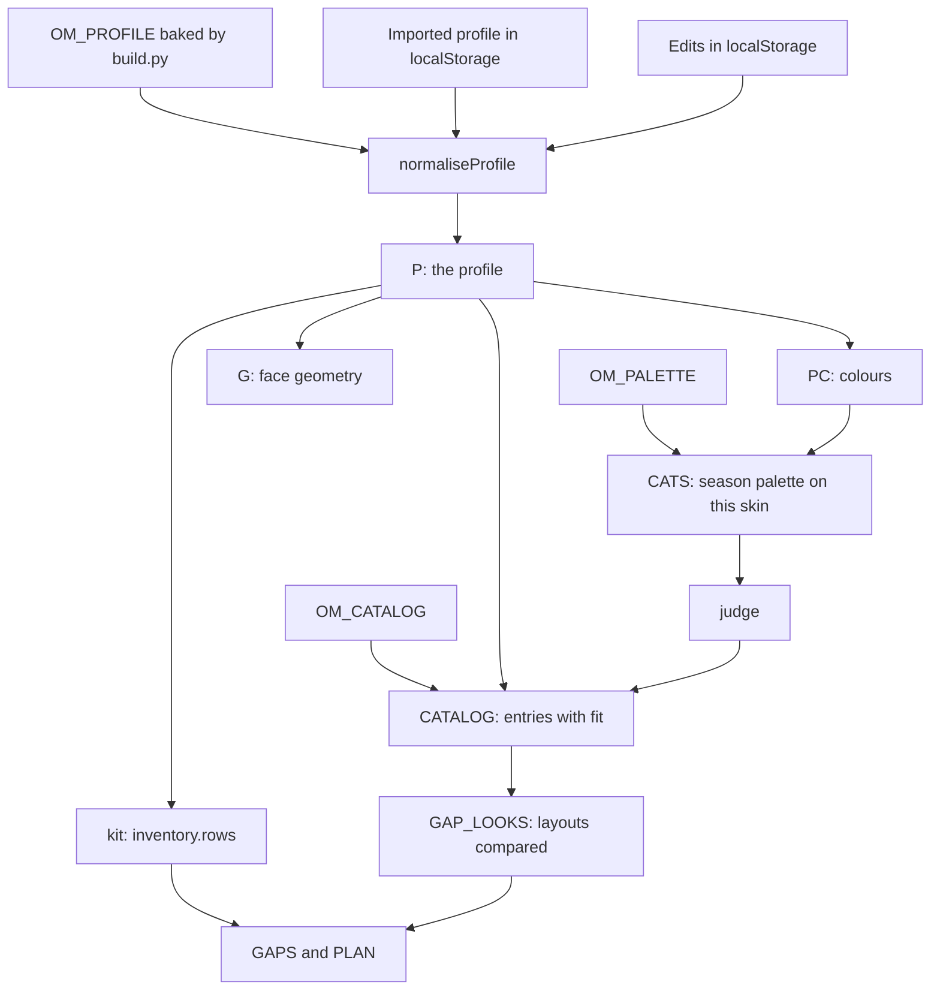

# Architecture

openmakeup is one self-contained HTML page. A Python build script joins a profile, a layout catalogue, a season palette, the CSS and the JavaScript into that page. There is no server and no framework.

- [Repository layout](#repository-layout)
- [Why one HTML file](#why-one-html-file)
- [Source files](#source-files)
- [Data flow](#data-flow)
- [How fit is decided](#how-fit-is-decided)
- [Test API](#test-api)
- [Scripts](#scripts)

## Repository layout

```text
app/index.html              the demo build, committed
data/layouts-catalog.json   the layout catalogue (169 entries)
data/palettes/              season palettes (deep-autumn.json)
docs/                       this documentation
profiles/demo.json          a fictional example profile
profiles/*.local.json       personal profiles, ignored by git
scripts/build.py            builds the page
scripts/smoke.mjs           headless browser smoke test
scripts/check-private.sh    blocks personal data from commits
src/template.html           page shell
src/style.css               all styles
src/js/*.js                 the application, in filename order
.githooks/pre-commit        runs check-private.sh
dist/                       personal builds, ignored by git
```

## Why one HTML file

A single file opens from disk or any static host with nothing to install, and a personal profile ships inside it. The only external request is the web fonts, which have fallbacks. The build script keeps the source in readable files and the output in one.

## Source files

The files in `src/js` are joined in filename order inside one function with `"use strict"`, so the numeric prefix is the load order and every file sees the ones before it.

| File | Owns |
|---|---|
| `00-core.js` | Colour math: hex parsing, HSL, Lab, LCh, CIEDE2000 (`dE`), mixing in linear light, colour naming, the difference words behind "lighter, warmer, more vivid". |
| `02-judge.js` | `judge()`: one colour against the skin, per product category. |
| `03-strings.js` | `STR`, every UI string as a `[vi, en]` pair. |
| `05-profile.js` | Storage, `normaliseProfile`, the profile `P` and its colours `PC`, the season palette for this skin (`CATS`), the catalogue view with fit (`CATALOG`) and the profile's looks. |
| `10-i18n.js` | Language state and `t`, `tn`, `dx`, `tx`. |
| `15-base.js` | Small shared maps (occasions, regions, kinds, fit order), icons and the UI state object. |
| `35-season.js` | Location presets, climate models and `season()`. |
| `36-weight.js` | The visual weight section of the Profile screen. |
| `40-gap.js` | The gap engine: matching, cross-use, clustering and `plan()`. |
| `45-inventory.js` | The kit model, which layouts are compared, shopping state and its persistence. |
| `46-shared.js` | Names and wording shared by the kit and layout screens. |
| `50-shop.js` | The "Cần mua" and "Đồ đang có" sheets, and the "your kit for this layout" block. |
| `58-face-geom.js` | The face geometry generator. |
| `60-face.js` | The face SVG and `adaptDiagram`. |
| `65-looks.js` | Helpers for a profile's adapted looks: the adapted and original diagrams, swaps and notes. |
| `70-screens.js` | The screens: Today, Palette, Layouts, layout and catalogue detail, Skin, Profile. |
| `80-sheets.js` | The generic colour checker for base, blush, eyes, contour and highlight. |
| `85-shell.js` | Navigation, rendering, events, export and import. |
| `90-colors.js` | "Màu của bạn", the colour picker, and the lip and brow checkers. |
| `99-boot.js` | Reading older storage keys, URL-hash routing and the first render. |

## Data flow

`scripts/build.py` writes three constants in front of the application code. Everything else is computed in the browser.

| Constant | From |
|---|---|
| `OM_CATALOG` | `data/layouts-catalog.json` |
| `OM_PALETTE` | `data/palettes/<season>.json` |
| `OM_PROFILE` | The profile passed to `--profile` |



- The effective profile is the imported profile (or the baked one) with edits merged on top. See [profile.md](profile.md#where-state-is-stored).
- `CATS` is the season palette made for this skin. Most colours are fixed hexes; foundation and concealer shades are offsets in lightness, chroma and hue from the skin colour.
- `CATALOG` is the catalogue with a fit for each entry; the next section says how.
- `GAP_LOOKS` are the layouts the shopping list compares. They come from the profile's looks or, by default, from the best-fitting catalogue entries. See [shopping-gap.md](shopping-gap.md).
- `G` is the geometry the face drawing reads. See [face-geometry.md](face-geometry.md).

### Hash routes

The URL hash is `#screen.flag.flag`. Screens: `today`, `palette`, `layout`, `skin`, `profile`, `checker`, `shopping` and `inventory`. Flags: `en` (English), `month-N` (test a month, see [location.md](location.md)), `look-<id>` and `cat-<id>` (open a layout detail).

## How fit is decided

Every catalogue entry shows a fit for this person: `Hợp sẵn` (suits as it is), `Đổi màu là hợp` (suits with colour swaps), `Khó hợp` (hard to fit) or `Tham khảo` (for reference only). Three sources can set it. The first that exists wins:

1. **A look.** When the profile has an adapted look with the entry's id, its `fit.label` is the fit, and the detail page shows the look's `fit.reason`.
2. **`catalogFit`.** A profile entry `{ level, reason }` for the entry's id.
3. **Computed.** `computeFit` in `05-profile.js`. Each palette colour of the entry whose role maps to a product category (lip, blush, eye main and depth, shimmer, liner, highlight, bronzer) is run through `judge()` against the skin. A colour that suits scores 1, an okay one 0.5, one that does not suit 0. The fit is `Hợp sẵn` at an average of 0.7 or more, `Đổi màu là hợp` at 0.4 or more and `Khó hợp` below. An entry with no judgeable colour, and every entry of kind `traditional`, is `Tham khảo`. The reason reads as "k of n colours in the palette suit the season".

Because `judge()` reads the undertone shift, the same catalogue gives a different fit to different profiles. The entry's own colours are drawn on the face with `catDiagram` in `70-screens.js`.

## Test API

`scripts/build.py --expose-test-api` appends `window.__om`, a handle on the engine for tests. It holds `judge`, `onSkin`, `adapted`, `original`, `faceSVG`, `CATS`, `CAT`, `LOOKS`, `CATALOG`, `P`, `PC`, `SKIN`, `dE`, `lab`, `lch`, `GAPS`, `GAP_LOOKS`, `SHOPST`, `recompute` and `plan()`. Shipped builds never carry it; build with the flag only into a scratch path.

## Scripts

| Script | What it does |
|---|---|
| `scripts/build.py` | Builds the page. `--profile` picks the profile (default `profiles/demo.json`), `--out` the output (default `app/index.html`), `--palette` and `--catalog` the data files, `--expose-test-api` the test handle. It refuses a profile with no valid `colors.skin.hex` or a season other than `deep-autumn`. |
| `scripts/smoke.mjs` | Opens a built page in headless Chrome and walks every screen, in Vietnamese and English at phone and desktop width. It opens every catalogue entry, every checker category, the shopping sheets and every picker, and, when run on `app/index.html`, tests profile import and reset. It fails on any console error, uncaught exception, missing text or raw string key. Run `node scripts/smoke.mjs app/index.html`, with `--shots <dir>` to save screenshots. It finds Chrome in the usual places, or from `$CHROME`. |
| `scripts/check-private.sh` | Fails when staged content (or, with `--all`, every tracked file) carries a personal marker: colours that identify the author, medication names, product names, home-directory paths, the author's name, email addresses, photo and screenshot file names, `*.local.json`, and a default city. The markers are listed in the script. |
| `.githooks/pre-commit` | Prints the staged files and runs `check-private.sh`. Enable it once with `git config core.hooksPath .githooks`. |

Build and test a personal profile without touching the committed demo:

```bash
python3 scripts/build.py --profile profiles/me.local.json --out dist/index.html
node scripts/smoke.mjs dist/index.html
```
