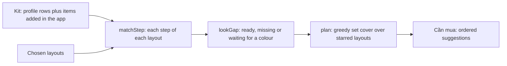

# Shopping list as a gap

The shopping list answers one question: to wear the layouts I chose, what must I buy on top of what I own, and which colour is missing? It is derived from the kit and the chosen layouts. It is not a manual list. The engine lives in `src/js/40-gap.js`, the kit model in `src/js/45-inventory.js` and the screens in `src/js/50-shop.js`.

- [Pipeline](#pipeline)
- [Data model](#data-model)
- [Which layouts are compared](#which-layouts-are-compared)
- [Matching tiers](#matching-tiers)
- [Cross-use rules](#cross-use-rules)
- [Cool-grey items](#cool-grey-items)
- [Layout state](#layout-state)
- [Ordering what to buy](#ordering-what-to-buy)
- [Required colours for palettes](#required-colours-for-palettes)
- [Scope](#scope)
- [Lifecycle and persistence](#lifecycle-and-persistence)

## Pipeline

Every change (a colour recorded, an item bought, a layout starred) runs `recompute()`, which rebuilds the gaps and the plan.

## Data model

The kit comes from `inventory.rows` in the profile (see [profile.md](profile.md#inventory)). Rows of one brand and product become one item with one pan per row.

| Item field | Type | Meaning |
|---|---|---|
| `id` | string | `o` plus the item's position in the kit, so the order of `rows` matters. |
| `cat` | enum | `nen`, `che`, `phu`, `khoa`, `mat`, `liner`, `ma`, `khoi`, `hl`, `may`, `son`, `chi`. |
| `role` | string | Decides cross-use: `cream` (a cream blush), `light` (a pale concealer pan), `depth` (a deep eyeshadow pan), `base` (a lid base) and so on. It comes from the row's `role`, except `tint`, which is set on a lip product that is glossy, tinted or marked `cheek_ok`. |
| `hex` | `#rrggbb` or `null` | `null` means the colour is unknown. It is never guessed, never matched, and never counted as covering a need. |
| `est` | boolean | The colour is an estimate (`confidence: low` with a hex). Shown as estimated, and a layout ready only through an estimate says so. |
| `noColor` | boolean | Setting powder, setting spray and clear products. They are never colour-matched and show as needing no colour. |
| `tone` | string | `cool` marks a cool grey. See [Cool-grey items](#cool-grey-items). |
| `pans` | array | For multi-row products: `{ hex, est, role, cat, n, label }` per pan. A pan may carry its own `cat`, such as a contour pan in a face palette. |

`role` on a multi-pan product is set per pan. A row's `role` becomes a pan role through this map: `deepen` gives `depth`, and `peach`, `dark` and `light` keep their names. The other row roles (`contour`, `highlight`, `transition`, `crease`) only change the pan's display name.

A layout step is `{ area, label, swatch, hex, cat, how, cool }`. A step with a colour and a category is matched. A step with no colour (setting powder) needs only the product type.

A step's `role` is derived from its label and `how`:

| Category | Role from the step |
|---|---|
| `mat` | `base` (lid base), `depth` (deep colour, smoky, shadow under the eye), `liner`, `shimmer`, otherwise `main`. |
| `hl` | `matte` when `how` says matte, otherwise `glow`. |
| `ma` | `cream` when `how` says cream or tint, otherwise `powder`. |
| `liner` | `liner`. |

## Which layouts are compared

The layouts come from one of two sources.

1. **The profile's looks.** When at least one look has `gap: true`, only those looks are compared. A look's steps are its items that have both `hex` and `cat`, plus a "setting powder" step. A brow-category step labelled as eyeliner becomes a `liner` step.
2. **The catalogue.** Otherwise the app takes catalogue entries of kind layout whose fit is "Hợp sẵn", "Đổi màu là hợp" or "Khó hợp", turns each palette colour into a step (lip, blush, eye main, eye depth, shimmer, liner, highlight and bronzer map to categories), and keeps entries with at least three steps. They are sorted by fit, then by how well known they are in Vietnam, then by id, and the first twelve are used.

The person stars the layouts they want to dress for. The default stars are the layouts that already suit (`Hợp sẵn`). With the catalogue source, when fewer than three suit, the first five are starred as well.

## Matching tiers

Each step is compared with the kit and lands in one of four tiers. The comparison uses a perceptual colour distance (CIEDE2000, kL = kC = kH = 1) in `dE()`. Two thresholds in `40-gap.js` decide the tiers:

| Constant | Value | Meaning |
|---|---|---|
| `MATCH` | `4` | At or below: practically the same colour. |
| `USABLE` | `8` | At or below: close enough to use. |

| Tier | Rule | UI word |
|---|---|---|
| `ok` | A product of the same category within `MATCH`. A step with no colour is `ok` when any product of the category exists. | `Trùng màu` (`Có sẵn` for a step with no colour) |
| `near` | The best same-category product within `USABLE`, or a cross-use stand-in within `USABLE` that is closer. A stand-in is never better than `near`, even when it is within `MATCH`. | `Gần giống – dùng được` |
| `unk` | Nothing usable, and a same-category product has no colour yet. | `Chưa có màu – thêm màu để so` |
| `miss` | Nothing usable. The result still names the nearest owned colour. | `Lệch màu – cần màu khác` |

Details:

- An eyeliner product answers every step whose role is liner, whatever its category. For all other steps, direct matches are products of the same category.
- An unknown-colour item never covers a need. The need stays on the list, flagged "You may already own this; add a colour to confirm", with the item named.
- The UI never shows a distance, a threshold or a hex code as a reason. It explains the difference in words, built from the strongest two of: lighter or deeper, warmer (more orange) or pinker, more vivid or more muted. The effect follows, for example that the colour will turn orange on skin. A swatch of the needed colour sits next to the owned one.
- Two steps in one layout that ask for the same colour (same category, within `MATCH`) count as one thing to buy.

## Cross-use rules

A product of another category can stand in for a step. Each rule is keyed by the step's category and role and the owned product's category and role. `*` means any.

| Step | Owned product | Meaning |
|---|---|---|
| `nen` | `che` | Concealer as spot foundation |
| `che` | `nen` | Foundation as concealer |
| `mat` main | `ma` | Blush as the main eye colour |
| `mat` depth | `khoi` | Contour as eye depth |
| `khoi` | `mat` depth or main | Eyeshadow as contour |
| `mat` base | `hl` matte | Matte highlight as lid base |
| `hl` matte | `mat` base | Lid base as matte highlight |
| `hl` matte | `che` light | Light concealer as matte highlight |
| `ma` cream | `son` tint | Lip tint as cream blush |
| `son` | `ma` cream | Cream blush as lip tint |
| `son` | `chi` | Lip liner filled in |
| `mat` liner | `may` | Dark brow pencil as liner |
| `liner` | `mat` depth | Dark eyeshadow as liner |

Cross-use needs a colour: a stand-in with an unknown colour is ignored.

## Cool-grey items

A product with `tone: cool` (a cool grey liner or brow product) satisfies a step only when the layout's palette family is cool-tone (`cool-pink`, `cold-girl` or `y2k`). In every other layout the item is set aside, and the step explains that the item suits only cool-tone layouts.

## Layout state

For each layout `lookGap` returns every step's tier and a state:

| State | When | Badge |
|---|---|---|
| `miss` | At least one step is `miss`. | `Thiếu N` |
| `unk` | Nothing is `miss`, but a step waits on an item with no colour. | `Chờ màu` |
| `ready` | Every step is `ok` or `near`. | `Đủ đồ` |

The summary line adds the count of items with unknown colours, and says "ready, with an estimated colour" when an estimate was used.

## Ordering what to buy

Missing steps of the starred layouts are cluster candidates. A candidate is one required colour: the colour wanted by most layouts comes first, and it absorbs same-category gaps within `USABLE`.

The plan is a greedy set cover. Candidates are rebuilt from what is still open each round. The candidate with the best score is chosen, then its gaps are removed, until nothing more is covered. Scores are compared in this order:

1. Starred layouts it completes (nothing left missing).
2. Starred layouts it touches.
3. Gaps it fills.
4. A multi-use bonus, given to a cream blush because it also works as a lip tint.

A candidate also covers a gap through cross-use, so a pick can cover steps of other categories.

Each suggestion shows why ("Missing this colour for: ..."), its value ("Buy 1 item and N layouts are covered", or "With the k items above, N more are covered"), the cumulative readiness, and the nearest owned colour in words, or a note that the kit has none in that category.

## Required colours for palettes

Some categories are bought as one product that holds many colours. Their gaps are grouped into one suggestion:

| Group | Categories | Suggestion |
|---|---|---|
| `eye` | `mat` | An eye palette with the listed colours |
| `face` | `khoi`, `hl` | A contour and highlight palette |
| `blush` | `ma` | A blush palette |

A group becomes a palette suggestion when it has two or more required colours; with one, it is an ordinary single-colour suggestion. Single-colour categories (brow, lip) always stay one colour per suggestion.

The list shows, for each required colour: a swatch, a plain name with its role, the layouts that need it, a tag, the nearest owned colour in words, and the flag for an unknown-colour item that may already cover it.

- The tag is "Must have" when the colour is needed by at least half as many layouts as the most-wanted colour (and at least two), otherwise "Nice to have".
- A note says a palette with more pans is fine as long as it has these colours.
- A profile can add the strings `req.refsT` and `req.refs` (through `i18n`) to show a collapsed list of reference palettes. The app ships none.

## Scope

Only categories the kit has a product for are compared. Steps in a category the profile's `inventory.rows` has nothing in are left out and the list says they are not counted, instead of reporting them missing. The scope is set when the app loads, from the profile's rows. Items added later in the app do not change it until the page reloads.

## Lifecycle and persistence

1. "Đã mua" on a suggestion opens a colour form prefilled with the suggested hex (one per pan for a palette). Saving adds the item to the kit, recomputes every layout and names the layouts that became ready.
2. "Thêm màu" on an item with no colour opens the same form for that item.
3. Starring or unstarring a layout recomputes the list. The layout page can add all of its missing items by starring it.
4. An item can also be added by hand in the kit tab (category, name, colour; powders and sprays need none).
5. "Add to list" in the colour checker adds a hand-written entry to a separate section. It does not affect the ordering.

Only what the person decided is saved, under `openmakeup.v1.shop` in `localStorage`:

| Part | Holds |
|---|---|
| `starred` | Ids of starred layouts. Ids that no longer exist are dropped on load. |
| `bought` | Items added through "Đã mua". |
| `colors` | Colours recorded for kit items, by item id, one per pan. |
| `custom` | Items added by hand to the kit. |
| `manual` | Entries added from the colour checker. |
| `split` | Reserved for items split from a multi-tint entry. Nothing creates one today. |
